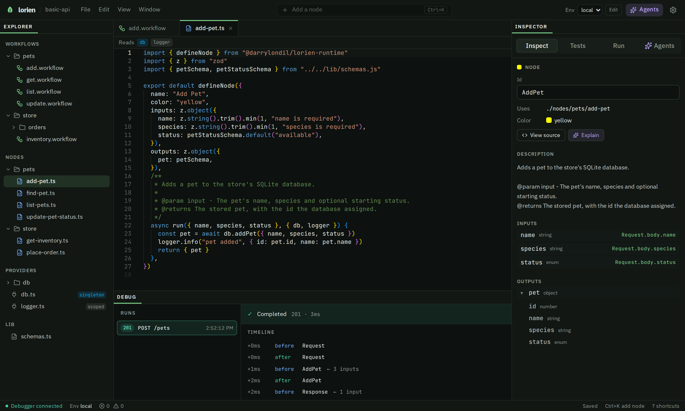

# lorien

**Build HTTP APIs as typed graphs you can see, test and debug, with AI agents working inside the same patterns you do.**

lorien is a runtime, build tool and in-browser IDE for TypeScript APIs. Every route is a small `.workflow` graph of typed nodes. Every piece of business logic is one node file. Every shared dependency (a database, a logger, an API client) is one provider file. Because the shapes are fixed, a person or an agent can open any project and know where everything lives, what calls what, and what each step received and returned.

When you ship, `lorien build` compiles the graphs to plain TypeScript. Production code has **zero lorien runtime dependency**.


## Why lorien

AI agents write a lot of code quickly. The hard part is knowing what they changed, where it runs, and what it touches. Free-form codebases make that hard: logic hides in route handlers, a new database client appears in a helper, and the only way to review is to read every diff line by line.

lorien gives your infrastructure a shape that is easy to follow, for humans and agents alike:

- **Routes are graphs, not code.** A `.workflow` file is a short JSON dependency graph. You see the whole route at a glance on the canvas, and a change to it reads as "this node now feeds that one", not a wall of handler code.
- **Logic lives in nodes, one per file.** A node declares its inputs and outputs with zod, so every edge in the graph is type-checked and every node can be tested alone.
- **Dependencies are declared, not discovered.** Providers are the only way a node reaches a database, logger or client. Each node card shows which providers it reads, and each provider lists every node that reads it.
- **The rules are written down for the agent.** New projects ship an `AGENTS.md` and a Claude Code skill that teach the same contract, so an agent adds a node where you would, not wherever it likes.
- **Every step is observable.** The debugger records what each node received and returned for every request, and tests can check any step, not just the final response.

## A tour of the IDE

### Workflows you can read at a glance

Open a `.workflow` and it becomes a canvas. Inputs are shown as value chips right on each node (`← Request.body.name`, `201`), wires are typed, and the Inspector describes the selected node from its own doc comment. Send a request and the Debug panel shows the timeline, node by node.

### Nodes are plain TypeScript



A node is a `defineNode` call with a zod schema in and a zod schema out. The IDE's editor is Monaco with full TypeScript, and the bar above the code shows which providers the node reads.

```ts
export default defineNode({
  name: "Add Pet",
  inputs: z.object({ name: z.string(), species: z.string(), status: petStatusSchema.default("available") }),
  outputs: z.object({ pet: petSchema }),
  async run({ name, species, status }, { db, logger }) {
    const pet = await db.addPet({ name, species, status })
    logger.info("pet added", { id: pet.id, name: pet.name })
    return { pet }
  },
})
```

### Providers make your infrastructure visible


A provider is a `defineProvider` file under `providers/`, and its file name is the name nodes read it by. Lifetimes are `singleton` (created once at boot), `scoped` (once per request) or `transient`. The IDE shows each provider's lifetime, the environment variables it needs, and every node that depends on it, so "what touches the database?" has a one-click answer.

### Tests next to the thing they test


- **Node cases** (`*.cases.json`) run one node with given inputs, with providers mocked where it helps.
- **Workflow tests** (`*.requests.json`) are saved requests that call a route over HTTP, can mock a node (say, to simulate "database is locked") and can check what any step received or returned.
- `lorien test` runs all of them in CI, and the IDE badges each node and file with its pass count.

When a request fails, the Debug panel names the node that failed and offers **Ask AI to fix** with the trace attached.

## Quickstart

```bash
# Create a new project
npx create-lorien my-app
cd my-app
pnpm install

# Start the dev server and open the IDE
pnpm dev

# Build for production (plain TypeScript, no lorien runtime)
pnpm build
pnpm start
```

Other commands: `pnpm dev:server` (dev server only), `pnpm exec lorien ide` (IDE only), `lorien test` (run every node case and workflow test), `lorien import-openapi` (generate client nodes from an OpenAPI 3.x spec), `lorien init` (add `AGENTS.md` to an existing project).

## Project layout

```
my-app/
├── lorien.config.ts        # build target
├── workflows/              # HTTP routes as JSON dependency graphs
│   ├── *.workflow
│   └── *.requests.json     #   saved requests: the route's workflow tests
├── nodes/                  # typed compute units (defineNode): all business logic
│   ├── *.ts
│   └── *.cases.json        #   test cases for the node beside it
├── providers/              # injected dependencies (defineProvider): db, logger, clients
│   └── <name>.ts           #   singleton, scoped (per request) or transient
├── lib/                    # plain shared code: zod schemas, helpers
├── src/
│   └── server.ts           # entrypoint, calls startLorienServer
├── AGENTS.md               # the author's guide for humans and AI agents
└── README.md
```

A workflow is small enough to review in a diff:

```json
{
  "lorien": 1,
  "nodes": {
    "Request":  { "uses": "@core/http-request", "values": { "path": "/pets", "method": "POST" } },
    "AddPet":   { "uses": "./nodes/pets/add-pet",
                  "in": { "name": "Request.body.name", "species": "Request.body.species" } },
    "Response": { "uses": "@core/response", "in": { "body": "AddPet.pet" }, "values": { "status": 201 } }
  }
}
```

## Try the sample

[`examples/basic-api`](examples/basic-api) is a small pet store on Node's built-in SQLite, with six routes, a `db` and a `logger` provider, and tests at every layer. The screenshots above are that project in the IDE. To open it from this repo:

```bash
pnpm install
pnpm -r build
pnpm dev:demo      # IDE on http://localhost:5173, backed by examples/basic-api
```

## Packages

| Package | What it is |
|---|---|
| `@darrylondil/lorien-runtime` | Headless interpreter, `defineNode` / `defineProvider`, testing primitives |
| `@darrylondil/lorien-build` | The `lorien` CLI: build, dev, ide, test, init, import-openapi |
| `@darrylondil/lorien-openapi` | OpenAPI 3.x to client-node generator |
| `@darrylondil/lorien-ide` | Browser IDE: Vite, React 19, Tailwind v4, React Flow, Monaco |
| `create-lorien` | `npx create-lorien <name>` scaffolder |

## Development

This is a pnpm workspace. Common commands:

```bash
pnpm install              # install all workspaces
pnpm -r build             # build every package
pnpm test                 # run every package's tests
pnpm -r typecheck         # tsc across the workspace
pnpm exec biome check .   # lint + format check
```

To work on the IDE with live data from `examples/basic-api`, run `pnpm -r build` once, then `pnpm dev:demo`. It starts the backend (`lorien ide --no-open --root examples/basic-api --port 3737`, serving `/api/*`) and the Vite dev server on port 5173, which proxies `/api/*` to it with HMR enabled. For the IDE alone, run `pnpm dev` in `packages/ide`.

Browser tests for the IDE live in `packages/ide/e2e` and run against the real IDE server on the sample project.

## Documentation

- Node tests: [`docs/node-tests.md`](docs/node-tests.md)
- Saved requests and workflow tests: [`docs/saved-requests.md`](docs/saved-requests.md)
- Design specs and plans: `docs/superpowers/`
- Publishing guide: [`PUBLISHING.md`](PUBLISHING.md)

## License

MIT, see [`LICENSE`](LICENSE).
