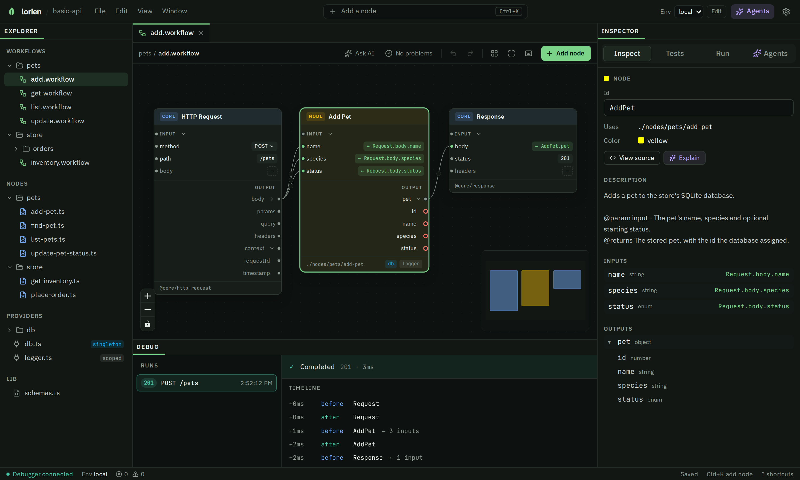
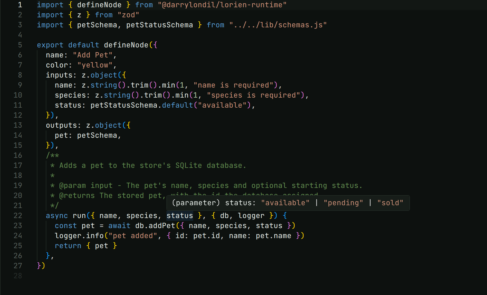
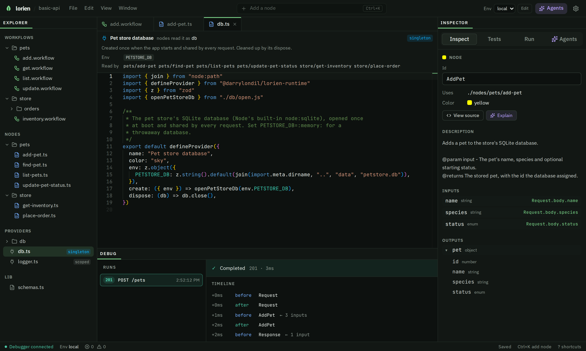
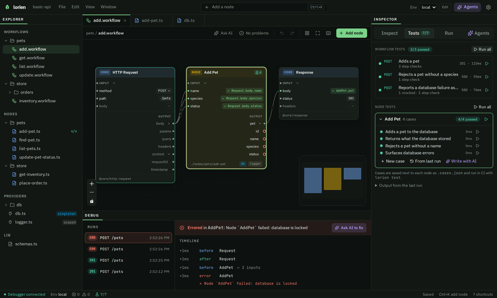
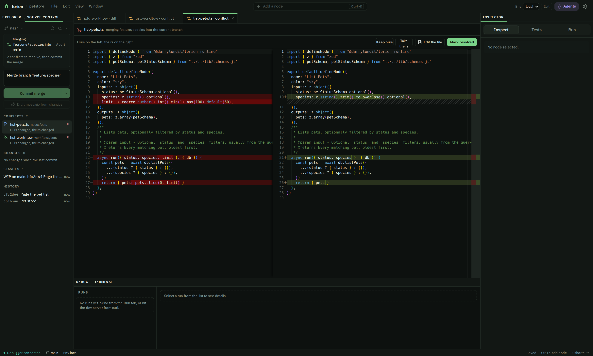

<div align="center">


# lorien

 <i>API workflows, woven in Lórien.</i>

**Typed, visual HTTP APIs that you and your AI agents can both see into.**

Routes are graphs. Logic is nodes. Infrastructure is providers. Every edge is typed with [zod](https://zod.dev).
<br />
It ships as plain TypeScript with **zero lorien runtime dependency**.


[Quickstart](#quickstart) · [Why lorien](#why-lorien) · [Typed end to end](#typed-end-to-end) · [The IDE](#a-tour-of-the-ide) · [Source control](#source-control) · [Sample](#try-the-sample) · [Packages](#packages)

</div>

<br />



<br />

## Quickstart

```bash
pnpm create lorien my-app     # or: npm create lorien@latest my-app
cd my-app
pnpm dev                      # dev server + IDE in your browser
```

The scaffolder installs dependencies with the package manager you ran it from. The new project's `AGENTS.md` (and Claude Code skill) is the guide for agents working in it.

When you're ready to ship:

```bash
pnpm build        # plain TypeScript + Hono in dist/, no lorien runtime
pnpm start
```

<details>
<summary><b>All CLI commands</b></summary>

| Command | What it does |
|---|---|
| `lorien dev` | Start the dev server and open the IDE (`--no-ide` to skip the IDE) |
| `lorien ide` | Open only the IDE |
| `lorien build` | Generate `dist/` from `workflows/`, `nodes/` and `providers/` |
| `lorien test` | Run every node case and saved request |
| `lorien check` | Flag code in the wrong place: a node reading `process.env`, a provider with business logic, a bad selector |
| `lorien types` | Write `.lorien/types/providers.d.ts` so nodes see each provider's type |
| `lorien import-openapi` | Generate typed client nodes from an OpenAPI 3.x spec |
| `lorien init` | Add `AGENTS.md` and the Claude Code skill to an existing project |

</details>

## Why lorien

AI agents write code fast. The hard part is knowing **what they changed, where it runs, and what it touches**. In a free-form codebase, logic hides in route handlers, a second database client appears in some helper, and the only way to review is to read every diff line by line.

lorien gives your API a fixed shape that is easy to follow, for people and agents alike:

| | Pattern | What you get |
|---|---|---|
| 🗺️ | **Routes are graphs.** A `.workflow` file is a short JSON dependency graph. | You see a whole route at a glance, and a change reads as "this node now feeds that one", not a wall of handler code. |
| 🧩 | **Logic lives in nodes**, one `defineNode` per file. | Each node is small, typed and testable on its own. |
| 🔌 | **Infrastructure lives in providers**, one `defineProvider` per file. | Nodes reach a database, logger or client only through a provider, so "what touches the database?" has a one-click answer. |
| 📐 | **The rules are written down for agents.** New projects ship `AGENTS.md` and a Claude Code skill. | An agent adds a node where you would, not wherever it likes. |
| 🔎 | **Every step is observable.** The debugger records each node's inputs and outputs per request. | Tests and reviews can check any step, not just the final response. |

## Typed end to end

lorien uses **[zod](https://zod.dev) (v4)** as its schema language. A node's zod schemas are the single source of truth, and everything else is derived from them: the TypeScript types in your editor, the checks on the graph, the runtime validation, and the shapes the IDE shows. Below, `run()` knows `status` is `"available" | "pending" | "sold"` straight from the `z.enum`, with no type written by hand.



Here is where those types go:

| Layer | How it's typed |
|---|---|
| **Node inputs and outputs** | `run()` receives `z.infer<typeof inputs>` and must return `z.infer<typeof outputs>`. |
| **Providers** | `lorien` generates `.lorien/types/providers.d.ts`, so `{ db, logger }` in `run()` are typed from each provider's `create()`. |
| **Provider config** | A provider declares `env: z.object({ ... })`, and it's parsed with zod once at boot. |
| **Graph wiring** | A reference like `Request.body.name` or `AddPet.pet` is checked against the source node's output schema. A typo shows up in the IDE's Problems list before you run anything. |
| **Runtime** | Before `run()` is called, each node's inputs are parsed with its zod schema. This happens in the dev interpreter *and* in the compiled production code. |
| **The IDE** | The Inspector, value chips and enum pickers all read the schemas. That's how the HTTP `method` gets a dropdown and `pet` expands to `id · name · species · status`. |

> **Production is just TypeScript.** `lorien build` compiles each workflow into a plain [Hono](https://hono.dev) route that imports your nodes and calls `inputs.parse(...)` from zod directly. Your deployed server doesn't import lorien at all.

## A tour of the IDE

<table>
<tr>
<td width="50%" valign="top">

### 🗺️ Workflows at a glance

Open a `.workflow` and it becomes a canvas. Inputs appear as value chips on each node (`← Request.body.name`, `201`), wires are typed, and the Inspector describes the selected node from its own doc comment. Send a request and the Debug panel shows the timeline, node by node.

</td>
<td width="50%" valign="top">

### 🔌 Providers make infrastructure visible

A provider card shows its **lifetime** (`singleton`, `scoped` per request, or `transient`), the **environment variables** it needs, and **every node that reads it**. Node cards show the providers they depend on as chips.

</td>
</tr>
</table>



### 🧭 The whole app on one map

**View › Application map** (or the button at the top of the Explorer) shows every route, node, middleware and provider in the project and how they connect. **Lanes** lines them up as Middleware, Workflows, Nodes and Providers. **Graph** pulls connected things together instead. Hover anything to light up its whole chain, search or focus on a folder to cut the map down, and the Overview counts routes and how many nodes use each provider. It's read-only, so it's a safe way to get your bearings in a project you, or an agent, just changed.


### ✅ Tests next to the thing they test



- **Node cases** (`*.cases.json`) run one node with given inputs, with providers mocked where it helps.
- **Workflow tests** (`*.requests.json`) are saved requests that call a route over HTTP. They can mock a node (say, to simulate `database is locked`) and check what any step received or returned.
- **`lorien test`** runs all of them in CI. The IDE badges each node and file with its pass count.

When a request fails, the Debug panel names the node that failed and offers **Ask AI to fix** with the trace attached.

## Source control

The IDE has a **Source Control** tab beside the Explorer, so the whole git loop happens where you edit: branch, commit, merge, fetch, pull and push. It's plain git underneath, working on your real repository, so everything it does shows up in `git log` and on GitHub like any other commit.

| | Action | What happens |
|---|---|---|
| 🌿 | **Branches** | The branch menu finds, switches to and creates branches. Picking a remote branch such as `origin/feature/species` creates a local branch that tracks it. |
| 🔄 | **Fetch** | Fetches every remote and prunes branches that were deleted there. The bar then shows how far you are ahead (↑) and behind (↓). |
| ⬇️ | **Pull** | Merges the upstream branch into yours. It always merges and never rebases, so your history is never rewritten. |
| ⬆️ | **Push** | Pushes the current branch. A branch with no upstream shows **Publish branch** instead, which pushes it to `origin` and tracks it. |
| 🔀 | **Merge** | Merges another branch into the current one. If git can't combine a file, the merge stays open and the file is listed under **Conflicts**. |
| 📝 | **Commit** | Stage files and commit, or commit everything when nothing is staged. The commit button's menu has **Commit & push**, **Commit & sync**, **Amend last commit** and **Undo last commit**. **Draft message from changes** writes a message from what's staged, naming the nodes that changed in each workflow. |
| ↩️ | **Discard and stash** | Discard one file's changes or all of them (after a confirm). Stash your changes, then pop, apply or drop a stash from the Stashes list. |

### Workflow changes read as graph changes

A `.workflow` is JSON, but you don't review it as JSON. Open a changed workflow from Source Control and the diff is drawn on the canvas: nodes are badged **added**, **changed** or **removed**, a rewired input shows the old reference struck through above the new one, and every change is listed as a sentence. Each change in the list can be reverted on its own, and the **JSON** toggle shows the raw text diff when you want it. Rows in the Changes list carry the same summary, like `1 node added, 1 changed`.


### Merge conflicts

While a merge is open, a banner shows what is merging into what, how many conflicts are left, and an **Abort** button. Switching branches, pulling, pushing and starting another merge all wait until you commit or abort the merge. **Commit merge** stays blocked until every conflict is resolved, including conflicts in files outside the lorien project when it lives inside a larger repository.

Say `main` and `feature/species` both changed the pet list route. Here's how each kind of file resolves.

#### A conflict in a node (or any script)

Both branches edited the same lines of `nodes/pets/list-pets.ts`. `main` added a `limit` input, and `feature/species` made the `species` filter case-insensitive:

```ts
// nodes/pets/list-pets.ts, as git leaves it
export default defineNode({
  name: "List Pets",
  inputs: z.object({
    status: petStatusSchema.optional(),
<<<<<<< HEAD
    species: z.string().optional(),
    limit: z.coerce.number().int().min(1).max(100).default(50),
=======
    species: z.string().trim().toLowerCase().optional(),
>>>>>>> feature/species
  }),
  // ...
})
```

Code files are text, so they resolve as text. The conflict view puts **ours** (the branch you're on) and **theirs** (the branch coming in) side by side, and you have three ways out:




- **Keep ours** or **Take theirs** resolves the file as one side had it. If that side deleted the file, the file is deleted.
- **Edit the file** opens it in the code editor. Fix it by hand, then press **Mark resolved**. lorien checks the file first and refuses while any `<<<<<<<`, `=======` or `>>>>>>>` marker is left, so a half-fixed file can't be committed by accident.

Here the right answer keeps both changes:

```ts
  inputs: z.object({
    status: petStatusSchema.optional(),
    species: z.string().trim().toLowerCase().optional(),
    limit: z.coerce.number().int().min(1).max(100).default(50),
  }),
```

Because a node's zod schema is its contract, the resolved `inputs` is what the graph checks against next. If the merge left a workflow reading an output that no longer exists, or a required input with nothing wired to it, the Problems list says so before you run anything. Since each node is one small file, a conflict like this stays a few lines long.

#### A conflict in a workflow

Both branches also changed `workflows/pets/list.workflow`. `main` wired a new `limit` input and read `species` from `?kind=`. `feature/species` read `species` from `?type=` and made the response status explicit:

```jsonc
// main (ours)                                   // feature/species (theirs)
"ListPets": {                                    "ListPets": {
  "uses": "./nodes/pets/list-pets",                "uses": "./nodes/pets/list-pets",
  "in": {                                          "in": {
    "status":  "Request.query.status",               "status":  "Request.query.status",
    "species": "Request.query.kind",                 "species": "Request.query.type"
    "limit":   "Request.query.limit"               }
  }                                              },
},                                               "Response": {
"Response": {                                      "uses": "@core/http-response",
  "uses": "@core/http-response",                   "in": { "body": "ListPets.pets" },
  "in": { "body": "ListPets.pets" }                "values": { "status": 200 }
}                                                }
```

Git compares lines, so it stops on the `species` hunk. lorien doesn't use git's conflict markers for workflows at all. It reads the base, ours and theirs versions and does a **three-way merge of the graph**, node by node and input by input:

- Changes to **different nodes** combine. `Response` gets `status: 200` from theirs.
- Changes to **different inputs of the same node** combine. `ListPets` keeps `limit` from ours.
- A change **only one side made** wins, and so does a change both sides made identically.
- Only a part **both sides changed differently** is a conflict. Here that's `ListPets.species`.
- A node **removed on one side and changed on the other** is a conflict on the whole node.
- **Layout** never conflicts. A node moved on one side lands where it was moved, and if both sides moved it, ours wins.

The conflict view draws the merged workflow on the canvas, marked against ours, and lists each clash as a card with an **Ours / Theirs** switch:

```text
ListPets                            [ Ours ]  Theirs
  species
    ours     ← Request.query.kind
    theirs   ← Request.query.type      (struck through until picked)
```

Flip a card and the canvas redraws with that choice. **Save merge and mark resolved** writes the merged graph and stages it, and **Keep ours** / **Take theirs** are still there to take one side wholesale. When the only overlap was a line git couldn't place, like two branches wiring different inputs next to each other, the view says *Both sides combine without a clash*, and resolving is one click.


When the Conflicts list is empty, write a message (git's own `Merge branch 'feature/species'` is filled in for you) and press **Commit merge**. Then **Push**.

## Project layout

```text
my-app/
├── lorien.config.ts        # build target
├── workflows/              # HTTP routes as JSON dependency graphs
│   ├── *.workflow
│   └── *.requests.json     #   saved requests: the route's workflow tests
├── nodes/                  # typed compute units (defineNode): all business logic
│   ├── *.ts
│   └── *.cases.json        #   test cases for the node beside it
├── providers/              # injected dependencies (defineProvider): db, logger, clients
│   └── <name>.ts           #   singleton, scoped (per request) or transient
├── lib/                    # plain shared code: zod schemas, helpers
├── src/server.ts           # entrypoint, calls startLorienServer
└── AGENTS.md               # the author's guide for humans and AI agents
```

A workflow is small enough to review in a diff:

```json
{
  "lorien": 1,
  "nodes": {
    "Request":  { "uses": "@core/http-request", "values": { "path": "/pets", "method": "POST" } },
    "AddPet":   { "uses": "./nodes/pets/add-pet",
                  "in": { "name": "Request.body.name", "species": "Request.body.species" } },
    "Response": { "uses": "@core/http-response", "in": { "body": "AddPet.pet" }, "values": { "status": 201 } }
  }
}
```

And a provider is one file whose name is how nodes read it:

```ts
// providers/db.ts  →  nodes receive it as `db`
export default defineProvider({
  name: "Pet store database",
  env: z.object({
    PETSTORE_DB: z.string().default(join(import.meta.dirname, "..", "data", "petstore.db")),
  }),
  create: ({ env }) => openPetStoreDb(env.PETSTORE_DB),
  dispose: (db) => db.close(),
})
```

## Try the sample

[`examples/basic-api`](examples/basic-api) is a small pet store on Node's built-in SQLite (Node 22.13+). It has six routes, a `db` and a `logger` provider, and tests at every layer. The screenshots above show it in the IDE.

```bash
git clone https://github.com/darrylhuffman/lorien.git
cd lorien
pnpm install
pnpm -r build
pnpm dev:demo     # IDE on http://localhost:5173, backed by examples/basic-api
```

## Packages

| Package | What it is |
|---|---|
| [`@darrylondil/lorien-runtime`](packages/runtime) | Headless interpreter, `defineNode` / `defineProvider`, testing primitives. Peer deps: `zod` 4, `hono` 4 |
| [`@darrylondil/lorien-build`](packages/build) | The `lorien` CLI: build, dev, ide, test, init, import-openapi |
| [`@darrylondil/lorien-openapi`](packages/openapi) | OpenAPI 3.x to typed client-node generator |
| [`@darrylondil/lorien-ide`](packages/ide) | Browser IDE: Vite, React 19, Tailwind v4, React Flow, Monaco |
| [`create-lorien`](packages/create-lorien-api) | `npx create-lorien <name>` scaffolder |

## Development

This is a pnpm workspace.

```bash
pnpm install              # install all workspaces
pnpm -r build             # build every package
pnpm test                 # run every package's tests
pnpm -r typecheck         # tsc across the workspace
pnpm exec biome check .   # lint + format check
```

To work on the IDE with live data from the sample, run `pnpm -r build` once, then `pnpm dev:demo`. It starts the backend (`lorien ide --no-open --root examples/basic-api --port 3737`, serving `/api/*`) and the Vite dev server on port 5173, which proxies `/api/*` to it with HMR. Browser tests for the IDE live in `packages/ide/e2e` and run against the real IDE server on the sample.

**Docs:** [node tests](docs/node-tests.md) · [saved requests](docs/saved-requests.md) · design specs and plans in `docs/superpowers/` · [publishing](PUBLISHING.md)

## License

MIT, see [`LICENSE`](LICENSE). Issues and pull requests are welcome at [github.com/darrylhuffman/lorien](https://github.com/darrylhuffman/lorien).

<br />

<div align="center">
<sub>The name is a nod to Lothlórien, the golden wood in Tolkien's <i>The Lord of the Rings</i>.</sub>
</div>
